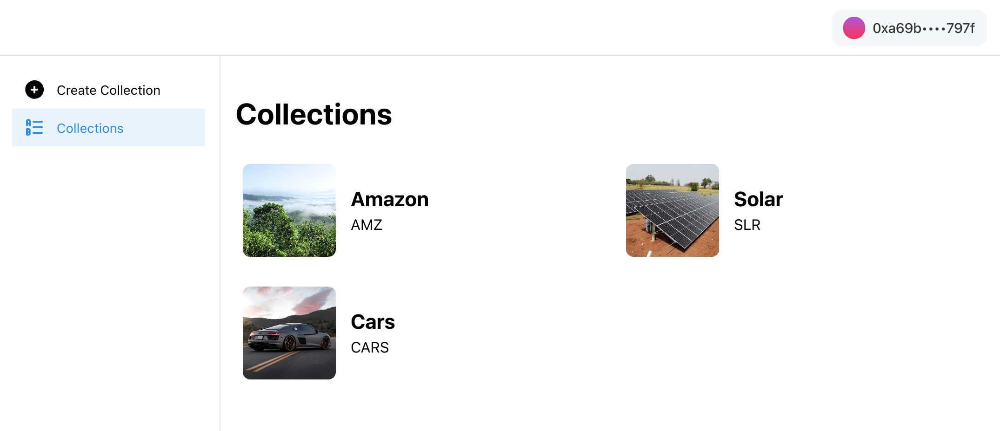
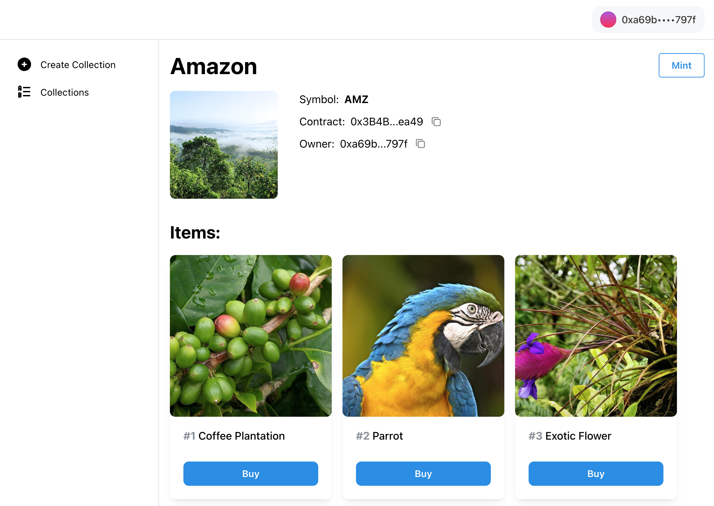
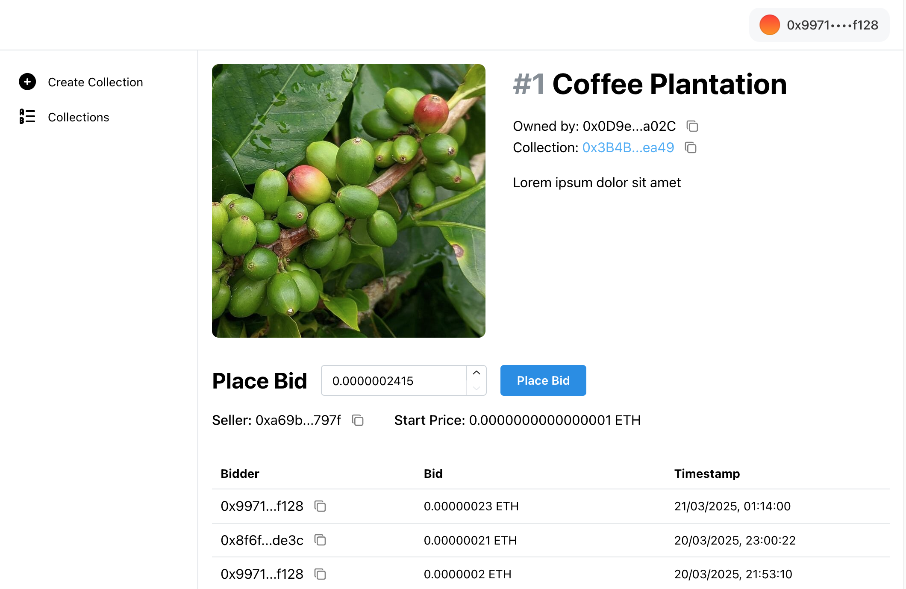

# NFT Marketplace

This is a mono repo for a NFT marketplace, build with Solidity, Hardhat, React, Typescript, Postgres and Supabase.

## Overview

The repo consists of 3 distinct parts:

1. web - React + Typescript + Wagmi + Viem dApp
2. hardhat - hardhat project with smart contracts
3. backend - an indexer which stores data in Postgres database. Supabase functions to upload files to IPFS (Pinata)

### dApp overview

The dApp is deployed on <a href="https://nft-marketplace-chi-livid.vercel.app" target="_blank" rel="noopener noreferrer">https://nft-marketplace-chi-livid.vercel.app</a> and supports to Base Sepolia

You can browse the collections and NFTs. To deploy a collection, mint NFTs and take part in a auction, please connect your wallet.

Collections page, display all collections

Collection details page, displays all NFTs in the collection

NFT page - displays details about NFT and auction for that NFT

### Smart contracts

Smart contracts are deployed on Base Sepolia

1. [NFTFactory](/hardhat/contracts/NFTFactory.sol) contract - used to deploy erc721 like contracts <a href="https://base-sepolia.blockscout.com/address/0xbc9979F1bb405565D789e2f70a60e4cA044eA9c3" target="_blank" rel="noopener noreferrer">0xbc9979F1bb405565D789e2f70a60e4cA044eA9c3</a>

2. [EnglishAuction contract](/hardhat/contracts/EnglishAuction.sol) - used to create, start, manage and bid on NFT auctions <a href="https://base-sepolia.blockscout.com/address/0x0D9e4EF64799398Ae55FbF45e5DaDa068A73a02C" target="_blank" rel="noopener noreferrer">0x0D9e4EF64799398Ae55FbF45e5DaDa068A73a02C</a>

3. [NFT contracts](/hardhat/contracts/NFT.sol) - erc721 based contracts - are deployed on demand using the NFTFactory contract

### Indexer

The indexer is build with Typescript, Ethers and Postgres (Supabase)

Indexer starting point is in [backend/indexer/index.ts](/backend/indexer/index.ts) file. There are 3 different indexers running:

1. [NFTFactoryIndexer](/backend/indexer/indexers/NFTFactory/NFTFactoryIndexer.ts) - On start it fetches all deployed NFT collections and then listens to newly deployed collections from NFTFactory contract

2. [NFTIndexer](/backend/indexer/indexers/NFT/NFTIndexer.ts) - On start it fetches all minted NFTs from all collections. Then it listens to newly minted NFTs from all collections

3. [EnglishAuctionIndexer](/backend/indexer/indexers/EnglishAuction/EnglishAuctionIndexer.ts) - On start it fetches all existing auctions and the listens to new bids and auction events

## Development

### Development Setup Instructions:

#### Hardhat - smart contracts

1. `cd hardhat` - go to hardhat directory
2. run `npm ci`
3. copy `hardhat/.env.example` into `hardhat/.env` and add environment variables
4. start local network, run `npm run node` - keep it running while you work
5. compile and deploy contracts, run `npm run reset:local` or use individual npm scripts
6. copy the deployed contracts addresses and use them in you backend and web environment variables
7. you can deploy contracts to other networks, make sure to add them to `hardhat/hardhat.config.ts`. There are already npm scripts for deploying to Base Sepolia, `npm run deploy:factory:base && npm run deploy:auction:base`

#### Backend - indexer

1. `cd backend` - go to backend directory
2. run `npm ci`
3. copy `backend/.env.example` into `backend/.env` and add environment variables
4. run `npm run dev` to start the indexer locally

#### Backend - Supabase

1. copy `backend/supabase/.env.example` into `backend/supabase/.env` and add environment variables
2. install Supabase CLI and login to Supabase
3. To run supabase database and edge functions locally refer to Supabase CLI. However for simplicity I recommend deploying:
4. run `npm run functions:push-secrets` to push environment variables to be used by Supabase functions
5. run `npm run functions:deploy` to deploy Supabase edge functions
6. To setup your Supabase Postgres database, use `/backend/supabase/schema.sql`. When using hosted Supabase instance, the easiest way to set it up is to copy the SQL and run it into SQL editor in your Supabase project dashboard. Alternatively refer to Supabase CLI documentation to run it from the CLI

#### Web - dApp

1. `cd web` - go to web directory
2. run `npm ci`
3. copy `web/.env.local.example` into `web/.env.local` and environment variables
4. run `npm run contracts:generate` to generate ABIs and hooks based on smart contracts from the hardhat project
5. run `npm run dev` to start development server

### Start development environment

1. `cd hardhat` and run `npm run node` to start local hardhat network
2. `cd hardhat` and deploy contracts, use individual scripts or run `npm run reset:local`
3. `cd backend` and run `npm run dev` to start the indexer. Indexer will read data from the contracts as well as listen to events and update the database.
4. `cd web` and run `npm run dev` to start the React app
5. If you want to actively develop smart contracts, run `npm run contracts:watch` in the `/web` directory, to fetch ABI changes. This uses wagmi CLI to get ABI changes as well as generate React hooks for interacting with smart contracts.
